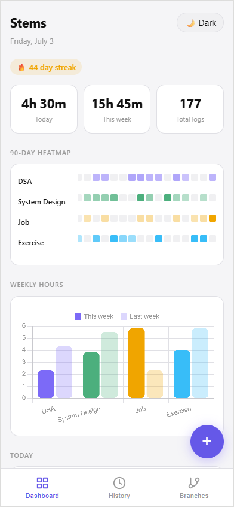
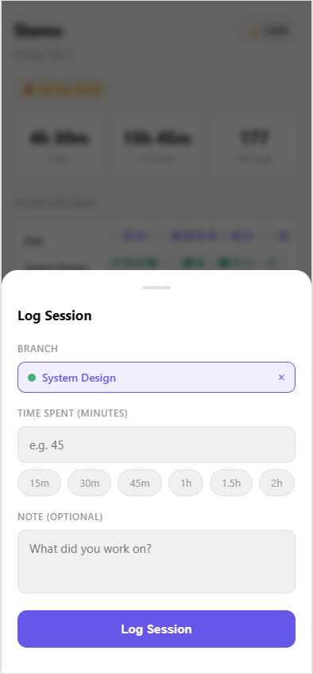
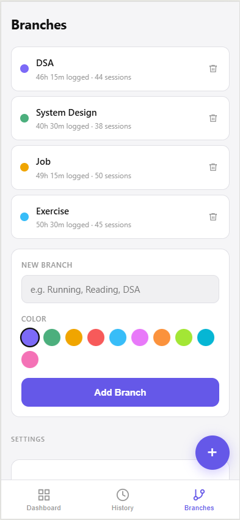

# Stems 🌿

A personal time tracker for things that matter — goals, habits, or anything you want to spend more time on. Logs sessions, shows a 90-day heatmap per branch, and pings you hourly so nothing slips through.

**Live:** [stems-three.vercel.app](https://stems-three.vercel.app) · **PWA** — install to your home screen on iOS and Android

---

## Screenshots

<p align="center">
  
  
  
</p>

---

## Features

- **Branches** — anything you track (DSA, Running, Reading, Work…). Type a new name in the log modal and it's created on the fly.
- **Log sessions** — pick a branch, set minutes with presets (15m → 2h), add an optional note.
- **90-day heatmap** — colour-coded consistency view per branch, scrolls to today automatically.
- **Weekly chart** — this week vs last week, per branch.
- **Streak counter** — consecutive days with at least one log.
- **Hourly reminders** — browser notifications at the top of each hour.
- **Quiet hours** — silence reminders during a time window (e.g. 10pm–8am).
- **Active days** — pick which days of the week to receive reminders (default Mon–Fri).
- **Cross-device sync** — sign in with email/password; data syncs via Supabase with Row Level Security.
- **PWA** — installable on iOS and Android, works offline with cached assets.
- **Light/dark theme**
- **Export/import JSON** — back up or restore your data anytime.
- **Delete logs** — remove individual entries from the dashboard or history.

---

## Stack

| Layer | What |
|---|---|
| Frontend | Vanilla JS, HTML, CSS — no framework, no build step |
| Charts | Chart.js (CDN) |
| Auth & sync | Supabase (email/password auth + PostgreSQL with RLS) |
| Notifications | Web Notifications API |
| Hosting | Vercel (auto-deploys on push) |

---

## Running locally

```bash
git clone https://github.com/xonaib/stems.git
cd stems
# Open index.html directly in a browser, or serve it:
npx serve .
```

No build step needed. The Supabase keys in `app.js` are the public anon key — safe to commit and use as-is.

---

## Install as PWA (mobile)

**iOS (Safari)**
1. Open [stems-three.vercel.app](https://stems-three.vercel.app) in Safari
2. Tap Share → Add to Home Screen
3. Sign in, enable notifications

**Android (Chrome)**
1. Open [stems-three.vercel.app](https://stems-three.vercel.app) in Chrome
2. Tap menu → Add to Home Screen
3. Sign in, enable notifications

---

## Database schema

```sql
-- branches
create table branches (
  id text primary key,
  user_id uuid references auth.users not null,
  name text not null,
  color text not null,
  created_at timestamptz default now()
);

-- logs
create table logs (
  id text primary key,
  user_id uuid references auth.users not null,
  branch_id text references branches(id) on delete set null,
  minutes integer not null check (minutes > 0),
  note text,
  ts bigint not null,
  created_at timestamptz default now()
);
```

Row Level Security is enabled on both tables — users can only read and write their own data.

---

## Deploying your own instance

1. Create a free [Supabase](https://supabase.com) project and run the schema above in the SQL editor
2. Copy your project URL and anon key into `app.js`
3. Deploy to [Vercel](https://vercel.com) — connect the repo and it auto-deploys on push

---

## Planned

- [ ] Background push notifications (VAPID + server endpoint)
- [ ] Per-branch weekly goals and progress bars
- [ ] Edit existing log entries
- [ ] Weekly summary view
